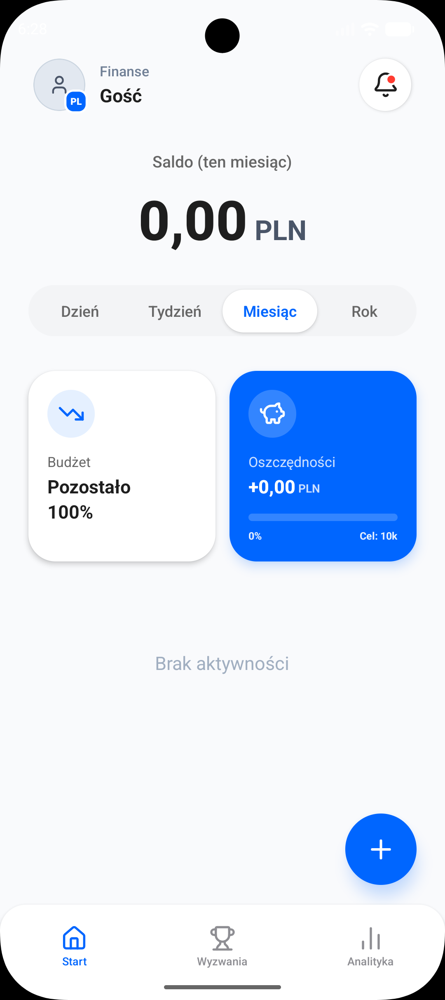
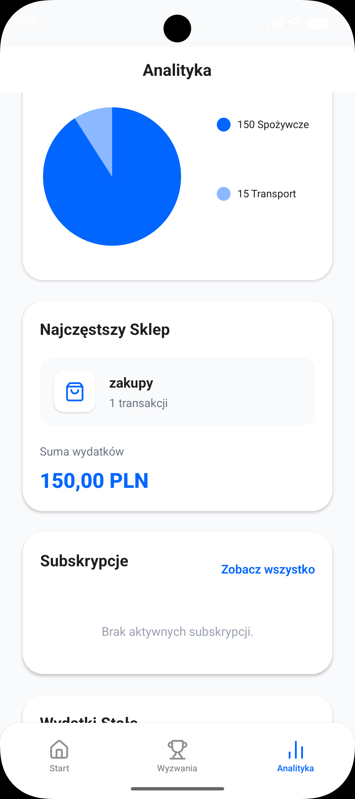
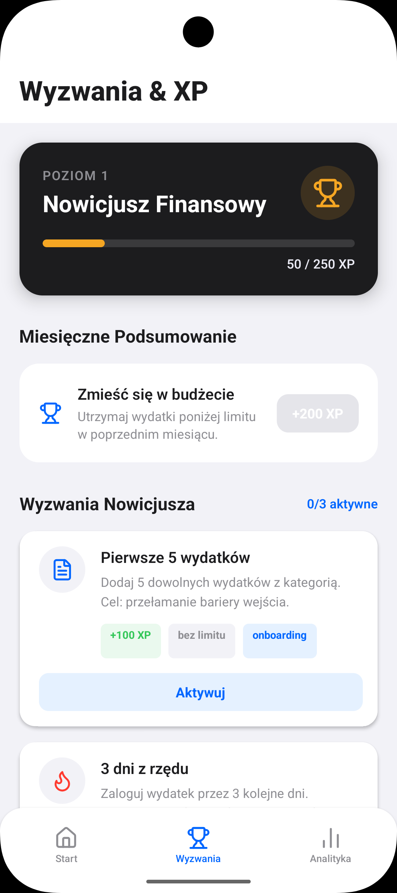

# FinanceMate 💰 (Beta Version)

🌍 **[English version](#-english)** | 🇵🇱 **[Polska wersja](#-polski)**

---

## 🇺🇸 English

Welcome to the official test repository for the **FinanceMate** app! 
Here you will find ready-to-download installation files (`.apk`) for Android. The application's source code is private.

### 🚀 Download the latest version

The latest test version is ready to install:
👉 **[Download FinanceMate v1.0.0-beta](https://github.com/MatiFBS/FinanceMate-Beta/releases/tag/v1.0.0-beta)**

### 📸 Screenshots

Here's what the app looks like:

| Home Screen | Analytics | Challenges |
|:---:|:---:|:---:|
|  |  |  |

### ✨ About the app

FinanceMate is your personal financial assistant designed to help you manage your budget and build healthy habits.

**Key features:**
- **🔐 Quick Login:** Secure authorization via Google account.
- **💰 Expense Tracking:** Intuitive interface and secure cloud data storage (you only see your own wallet).
- **🔥 Streaks System:** Gamification mechanism motivating you to control your finances daily.
- **🏆 Challenges:** A dedicated section with money-saving tasks.

### 📱 Installation guide (.APK)

Since the app is in the Beta phase and not yet available on Google Play, the installation process looks like this:

1. Go to the **Releases** tab (or click the link at the top of the page).
2. Scroll down to the **Assets** section and download the `.apk` file directly to your Android phone.
3. Open the downloaded file. If prompted, select **"Allow installation from unknown sources"**.
4. If a Google Play Protect warning appears, click *"More details"*, and then *"Install anyway"*.

### ⚠️ Bug Reporting & Feedback

The app is in an early testing phase. It requires an internet connection to work properly.
If you find a bug, the app freezes, or you have an idea for a new feature – let the creator know or open a ticket in the **Issues** tab! 

Thanks for testing! 🚀

---

## 🇵🇱 Polski

Witaj w oficjalnym repozytorium testowym aplikacji **FinanceMate**! 
Znajdziesz tutaj gotowe do pobrania pliki instalacyjne (`.apk`) dla systemu Android. Kod źródłowy aplikacji jest prywatny.

### 🚀 Pobierz najnowszą wersję

Najnowsza wersja testowa jest gotowa do instalacji:
👉 **[Pobierz FinanceMate v1.0.0-beta](https://github.com/MatiFBS/FinanceMate-Beta/releases/tag/v1.0.0-beta)**

### 📸 Zrzuty ekranu

Oto jak prezentuje się aplikacja:

| Ekran Główny | Analityka | Wyzwania |
|:---:|:---:|:---:|
|  |  |  |

### ✨ O aplikacji

FinanceMate to Twój osobisty asystent finansowy stworzony po to, by pomóc Ci zapanować nad budżetem i wyrobić zdrowe nawyki.

**Kluczowe funkcje:**
- **🔐 Szybkie logowanie:** Autoryzacja przez konto Google.
- **💰 Rejestrowanie Wydatków:** Intuicyjny interfejs i bezpieczny zapis danych w chmurze (każdy widzi tylko swój portfel).
- **🔥 System Nawyku (Streaks):** Mechanizm grywalizacji motywujący do codziennej kontroli finansów.
- **🏆 Wyzwania (Challenges):** Dedykowana sekcja z zadaniami oszczędnościowymi.

### 📱 Instrukcja instalacji (.APK)

Ponieważ aplikacja jest w fazie Beta i nie ma jej jeszcze w sklepie Google Play, proces instalacji wygląda następująco:

1. Przejdź do zakładki **Releases** (lub kliknij link na górze strony).
2. Zjedź do sekcji **Assets** i pobierz plik `.apk` bezpośrednio na swój telefon z systemem Android.
3. Otwórz pobrany plik. Jeśli system poprosi, wybierz **"Zezwól na instalację z nieznanych źródeł"**.
4. W przypadku pojawienia się ostrzeżenia od Google Play Protect, kliknij *"Więcej szczegółów"*, a następnie *"Zainstaluj mimo to"*.

### ⚠️ Zgłaszanie Błędów i Feedback

Aplikacja jest we wczesnej fazie testów. Potrzebuje dostępu do internetu, aby działać poprawnie.
Jeśli znajdziesz błąd, zawieszenie się aplikacji lub masz pomysł na nową funkcję – daj znać twórcy lub otwórz zgłoszenie w zakładce **Issues**! 

Dzięki za testowanie! 🚀
